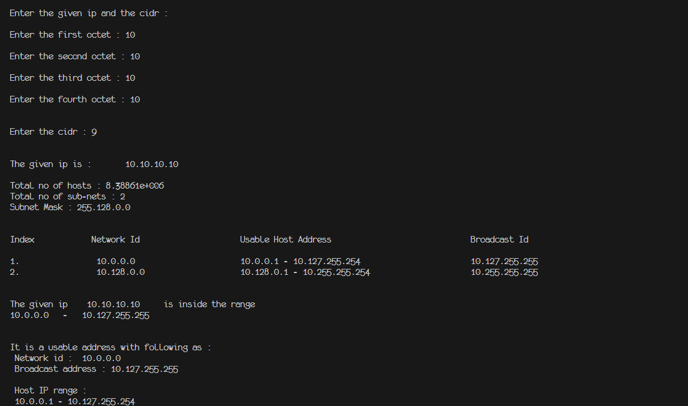
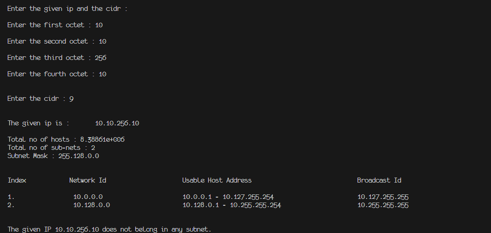

# This is a project for Subnet Range Calculation

## Contributors :

- [**Buddha Tamang**](https://github.com/Bud10)
- [**Gaurav Basnet**](https://github.com/GauravBasnet00)
- [**Gyan Hari Dahal**](https://github.com/Varl-Starkiller)
- [**Yubaraj Poudel**](https://github.com/poudel-yubaraj)

## **Features**

The main features of this project are:

- It calculates the subet range of the given ip-address.
- It stores the calculated subnet range in a `Single` link list.
- It finds the range in which the given ip-address is located.

## **How It works?**

1. It asks for the four octate of an ip-address along with its cidr.
2. It checks which class the given cidr belongs to.
3. It then calculates the addition factor for individual class to find the network address and an another factor to find the broadcast address.
4. The calculated ip-address range is then store in a `Single` link list.
5. Then the given ip-address is checked to the linked list and the range is calculated
6. After the range is calculated, it checks which range does the input address belong to using the `is_ip_inside_range` function.
7. If the ip is inside the range of the calculated subnet network, it checks whether it is a usable or an unsable network or braodcast address.
8. If it does not find the input ip-address in the calculated subnet network, it says that the given ip-address does not exist in the range.  

## **Preview**

ip-address exists in range

ip-address does not exist in range

